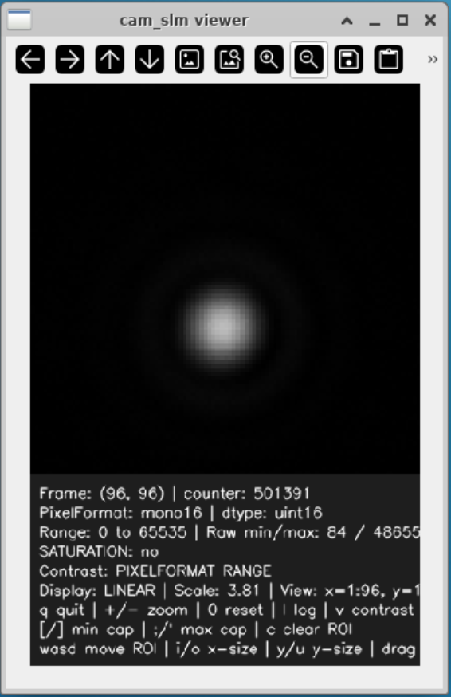
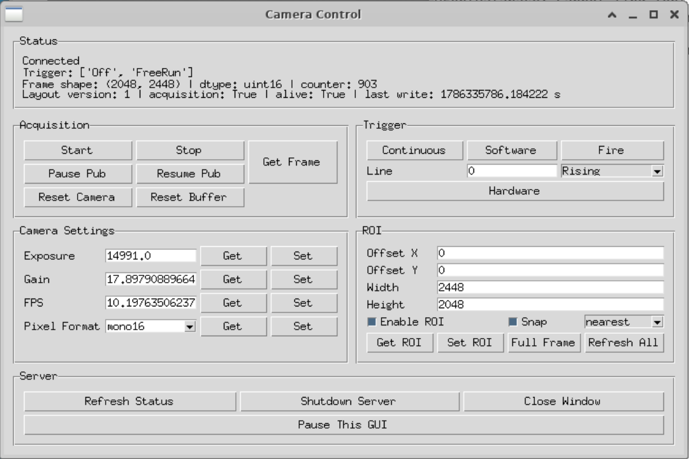
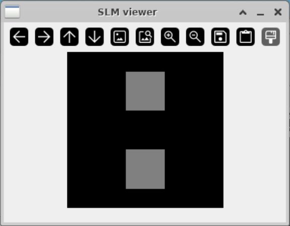

# Launch Servers, Viewers, and Control GUIs

JazLabs separates hardware access from viewing and control. A **server** owns
the hardware connection and keeps running while one or more **clients** read
its state, display live data, or send commands. A client can be a graphical
viewer, a control GUI, or Python experiment code. Starting the server first
ensures that none of these clients need to open the hardware directly.

The exact processes depend on where the hardware is connected:

- A camera server and its clients can run on the same computer.
- An SLM can use a hardware-facing server on Windows and a bridge/server on
  Linux. Linux clients then use the local bridge and shared-memory image.

Run every long-lived command in its own terminal or tmux window. The examples
below use `HDStokes` for the camera and `default_lab` for the bridged SLM.

## Before You Start

- Install JazLabs on every computer that will run a server, bridge, or client.
- Power on the hardware and install any required vendor drivers or SDKs.
- Check the selected file under `src/JazLabs/launchers/configs/`.
- Confirm that configured hosts and ports are correct and not already in use.
- For a connection between computers, confirm that the hosts can reach each
  other and that the configured ports are allowed through their firewalls.

The server and clients must use matching configuration values. A server can
bind to `0.0.0.0` to accept remote connections, but a client must connect to a
real host name or IP address rather than `0.0.0.0`.

## General Workflow

Bringing a supported instrument online normally follows the same pattern:

1. Add or select a hardware entry in a launcher configuration. Define its
   hardware type or identifier, server host, command port, and any data-stream
   ports or shared-memory names required by that instrument stack.
2. Start the hardware-facing server and leave it running. This process owns the
   vendor driver and physical device connection.
3. Start the matching viewer or control GUI with the same configuration. Use
   it to confirm that data and status are updating.
4. Connect experiment code through the instrument's client class, using the
   same host, ports, and stream settings as the server.
5. Close client objects when the experiment finishes, then stop the server.

The camera and SLM examples below show this pattern with two different data
paths: local camera shared memory and a networked SLM bridge.

## Example 1: Camera Server and Clients on One Computer

In this arrangement, the camera, server, live viewer, and control GUI are all
on the camera computer:

```text
Camera hardware
      |
      v
Camera server
      |
      +----> Live image viewer
      |
      `----> Camera control GUI
```

The `HDStokes` configuration sets `CAMERA_HOST` to `127.0.0.1`, so the clients
connect back to the server on the same computer.

### 1. Start the camera server

In the first terminal, run:

```bash
jazlabs-server-camera --config HDStokes --name cam_slm
```

The server opens the configured camera, creates the frame stream, and listens
on the configured command and frame-publication ports. Wait until it reports
that it is running, then leave this terminal open.

### 2. Start the client viewer and control GUI

In a second terminal on the same computer, run:

```bash
jazlabs-view-camera --config HDStokes --name cam_slm
```

This client launcher opens two windows:

- the live viewer, which displays frames received from the server; and
- the control GUI, which reads camera status and sends acquisition, trigger,
  exposure, gain, frame-rate, pixel-format, and ROI commands to the server.

The client is connected when the GUI reports `alive: True`. During continuous
acquisition it should also report `acquisition: True`, and the viewer's frame
counter should keep increasing.



The information panel beneath the image shows the frame shape and counter,
pixel format, raw minimum and maximum, saturation state, display contrast,
zoom, cursor value, and any selected display ROI. Contrast and zoom affect the
viewer only; hardware acquisition settings are changed through the control
GUI.



The control GUI communicates with the server rather than opening the camera
itself. This allows the server to remain the single owner of the hardware
connection.

To open only one client window, use:

```bash
# Live image only
jazlabs-view-camera --config HDStokes --name cam_slm --no-widget

# Camera controls only
jazlabs-view-camera --config HDStokes --name cam_slm --no-viewer
```

To open clients for all camera entries that are enabled in the configuration,
start their servers first and then run:

```bash
jazlabs-view-camera --config HDStokes --all
```

### 3. Connect from Python code

Experiment code connects to the same camera server as the viewer and GUI. It
must use the server's reachable host, command port, and frame-publication port.
For `cam_slm` in the `HDStokes` configuration, a minimal client is:

```python
from JazLabs.hardware.Cameras.Camera_Client import CameraClient


camera_client = None

try:
    camera_client = CameraClient(
        host="127.0.0.1",
        command_port=50733,
        frame_pub_port=50734,
        timeout_ms=60_000,
        client_id="camera_connection_example",
    )

    print("Server alive:", camera_client.IsServerAlive())
    print("Exposure [us]:", camera_client.GetExposureTime())

    previous_counter = camera_client.GetFrameCounter()
    frame = camera_client.GetFrame(
        WaitForNewFrame=True,
        LastFrameCounter=previous_counter,
    )
    print("Received frame:", frame.shape, frame.dtype)
finally:
    if camera_client is not None:
        camera_client.close()
```

The two ports have different jobs:

- `command_port` carries requests and replies, such as reading exposure or
  changing trigger mode.
- `frame_pub_port` announces new frames; the client reads the corresponding
  image from server-owned shared memory.

These values must match the selected entry in `CAMERA_SERVERS`. This camera
example deliberately runs the server and client on the same computer because
the current camera stack stores frame pixels in local shared memory. Changing
`127.0.0.1` to a remote IP is not enough to make that shared memory available
on another computer; use the camera bridge stack when remote frame access is
required. Give concurrent clients distinct `client_id` values so server logs
and errors identify the caller.

Always close the client in a `finally` block. Closing a client releases its
network sockets and shared-memory attachments; it does not shut down the
camera server or prevent another client from remaining connected.

## Example 2: SLM Server with a Linux Bridge and Viewer

The SLM example spans two computers. The SLM server owns the physical SLM.
The SLM bridge connects to the server, creates the local SLM
shared-memory stream, and forwards image and control traffic. The Linux viewer
reads the current image from that shared memory.

```text
Physical SLM
     |
     v
SLM server (Windows)
     |
     | network: commands, images, acknowledgements
     v
SLM bridge (Linux)
     |
     +----> Local SLM client and phase-mask procedures
     |
     `----> Shared memory ----> Linux SLM viewer
```

The order matters: start the hardware-facing server first, the bridge
second, and the Linux viewer or other clients last. The commands below use the
`SLM_SERVER`, `SLM_BRIDGE`, and `SLM_SHM_NAME` settings in
`default_lab.py`.

### 1. Start the hardware-facing server on Windows

On the computer physically connected to the SLM, open PowerShell in the
JazLabs environment and run:

```powershell
jazlabs-server-slm --config default_lab
```

Wait until the server has opened the SLM and reports its command, image, and
acknowledgement ports. Leave the PowerShell window open.

### 2. Start the bridge on Linux

On the Linux computer, run:

```bash
jazlabs-bridge-slm --config default_lab
```

The bridge connects to the SLM server configured by `server_host`, creates
the stream named by `shm_name`, and exposes a local command port for JazLabs
SLM clients. Wait until its startup information has been printed before
opening the viewer.

### 3. Start the client viewer on Linux

In another Linux terminal, run:

```bash
jazlabs-view-slm --config default_lab
```

The viewer reads the configured shared-memory stream and displays the image
currently being sent to the SLM. Apply or update a safe test mask through a
normal JazLabs SLM client or procedure and confirm that the displayed image
changes.



This window shows what is present in the Linux shared-memory stream. A changing
viewer confirms that the local client/bridge path is active; also check the
bridge and SLM-server terminals for display acknowledgements or errors
when confirming that the physical SLM updated.

## Launch Order at a Glance

### Same-computer camera

| Order | Computer | Process | Command |
|---:|---|---|---|
| 1 | Camera computer | Camera server | `jazlabs-server-camera --config HDStokes --name cam_slm` |
| 2 | Camera computer | Viewer and control clients | `jazlabs-view-camera --config HDStokes --name cam_slm` |

### Bridged SLM

| Order | Computer | Process | Command |
|---:|---|---|---|
| 1 | Windows SLM computer | Hardware-facing server | `jazlabs-server-slm --config default_lab` |
| 2 | Linux computer | SLM bridge | `jazlabs-bridge-slm --config default_lab` |
| 3 | Linux computer | Shared-memory viewer client | `jazlabs-view-slm --config default_lab` |

## Stopping the Processes

Close GUI windows normally. For a long-running server, bridge, or terminal
viewer, return to its terminal and press `Ctrl+C`. Stop clients before their
server so they do not continue waiting for a connection that has disappeared.

## Troubleshooting

- **A client times out:** check that the server or bridge is still running and
  that both processes use the same host and port values.
- **The camera client cannot connect on the same computer:** confirm that both
  commands use the same configuration and camera name, and that
  `CAMERA_HOST` is `127.0.0.1` or another local address.
- **The camera window opens but does not update:** confirm that the GUI reports
  `alive: True` and `acquisition: True`, and watch whether the frame counter
  advances.
- **The SLM bridge cannot reach the server:** verify `server_host`, the
  three Windows ports, firewall rules, and that the Windows server was started
  first.
- **The SLM viewer reports missing shared memory:** wait for the Linux bridge
  to create the configured stream and confirm that the viewer and bridge use
  the same `SLM_SHM_NAME` or `shm_name`.
- **The SLM viewer changes but the hardware does not:** inspect the Linux
  bridge and Windows server for acknowledgement or LUT/hardware errors. The
  viewer alone proves that shared memory changed, not that the SLM accepted the
  image.
